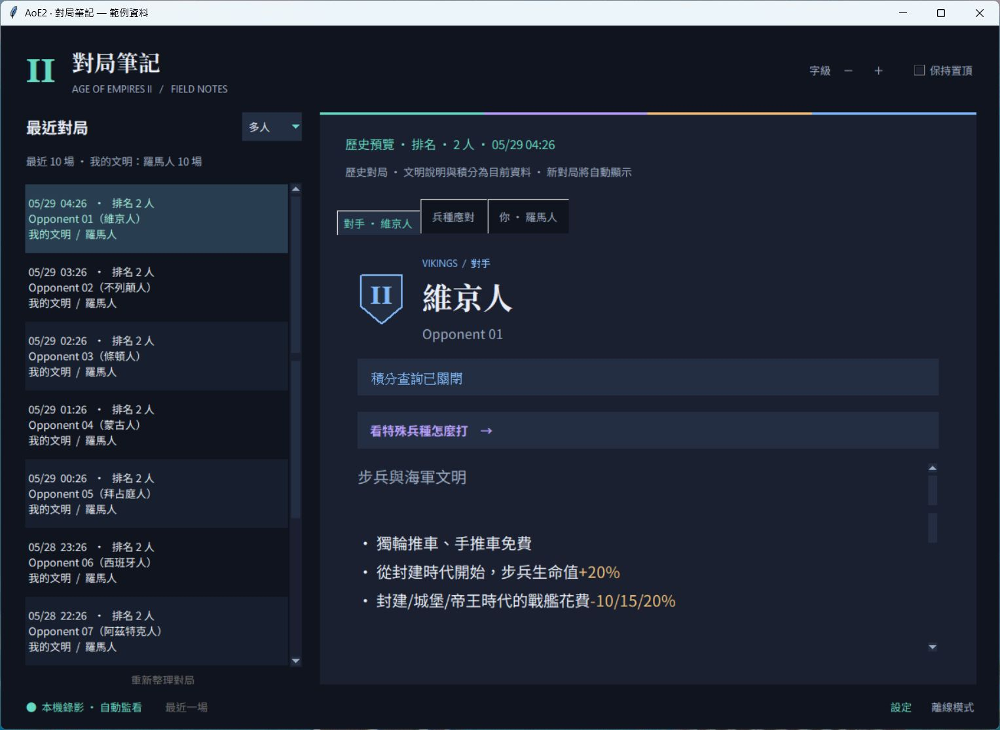
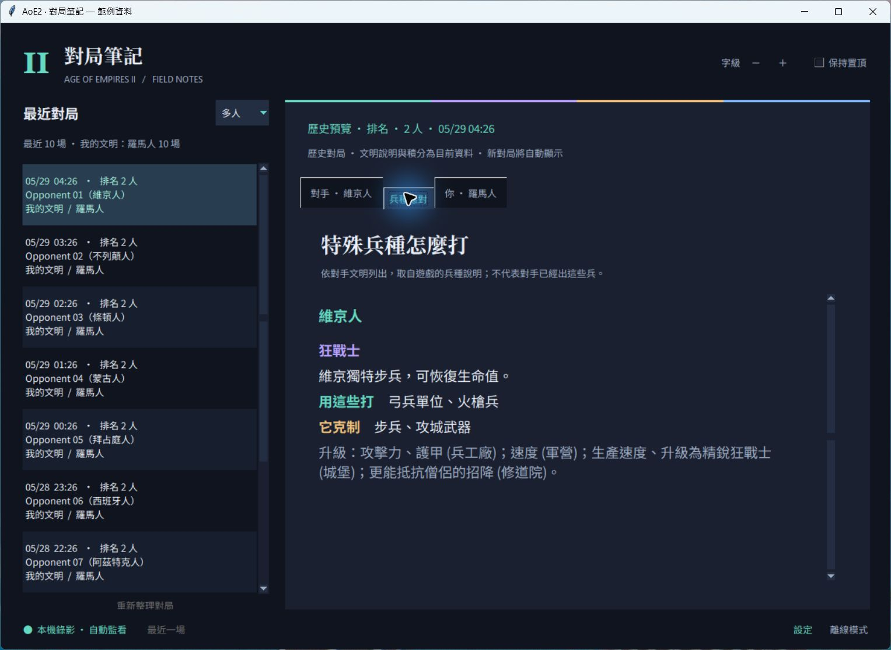

# AoE2 對局筆記

開局看對手文明、回顧最近 10 場、查特殊兵種怎麼打。適合放在第二螢幕。

## 下載

### [⬇ 下載 Windows EXE](https://github.com/HanaYukii/aoe2-tools/releases/latest/download/aoe2-opponent-dashboard.exe)

[所有版本與更新說明](https://github.com/HanaYukii/aoe2-tools/releases) · Windows 64 位元 · 免安裝 Python

需要先安裝 **Age of Empires II: Definitive Edition**。目前以 Windows Steam 版測試。

## 三步開始

1. 下載 EXE，放到常用資料夾後雙擊開啟。
2. 首次設定確認遊戲位置，從錄影偵測出的名單選「哪位玩家是你」，按「儲存並開始」。通常不必手填路徑或 ID；沒有錄影也可先使用自動判斷。
3. 開始一場有錄影的對局。工具偵測到新錄影後，會自動顯示文明資訊。

右下角「設定」可修改路徑、玩家、資料語言及積分查詢；儲存後重開生效。桌面捷徑可對 EXE 按右鍵 → 傳送到 → 桌面（建立捷徑）。

## 畫面範例

深色介面、可調字級與置頂。左側最近 10 場，右側切換對手、自己與隊友的文明。

點「看特殊兵種怎麼打」，直接跳到對手文明的兵種應對。

*截圖使用虛構玩家與範例對局。兵種應對來自遊戲說明，不代表對手實際出了這些兵。*

## 資料與限制

- 文明與兵種說明讀取使用者自己的遊戲安裝；EXE 不包含遊戲資料、個人錄影或帳號設定。
- 設定留在本機，不需要帳號密碼。積分查詢會將對局玩家的 profile ID 傳給官方排行榜 API，可在設定關閉。
- 最近 10 場來自本機錄影，可篩選多人／排名／全部；尚不包含勝敗、時長或歷史積分。顯示的是目前文明資料與目前積分。
- 只讀取錄影檔，不讀取遊戲記憶體、不注入。遊戲更新可能改變錄影格式；解析失敗時會提示。
- 本工具為非官方社群工具。EXE 尚未做程式碼簽章。

遇到問題可到 [Issues](https://github.com/HanaYukii/aoe2-tools/issues) 回報版本與錯誤訊息。

[開發、命令列與自行打包](opponent-civ/README.md)
